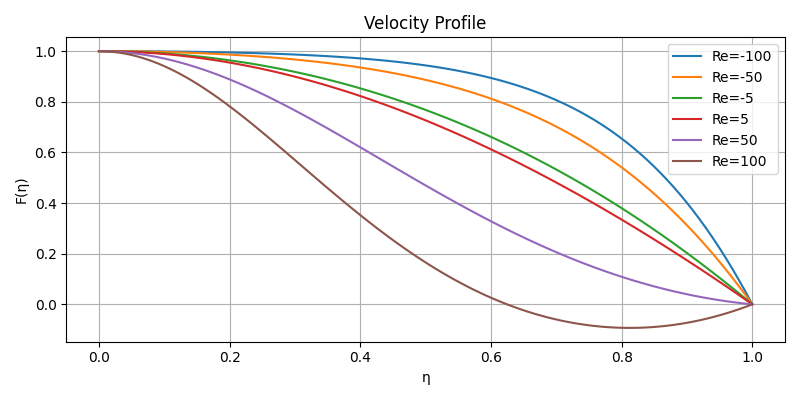
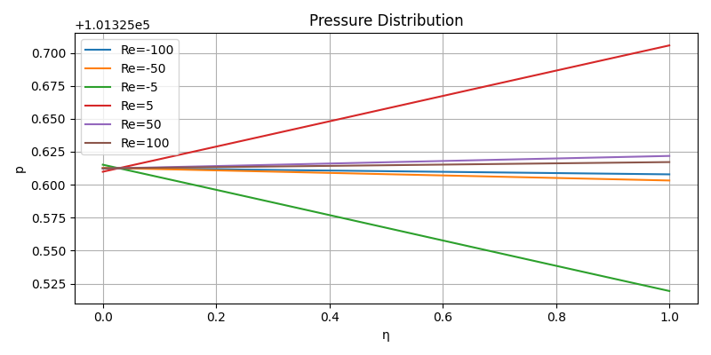
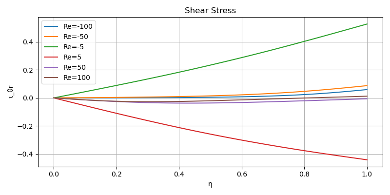
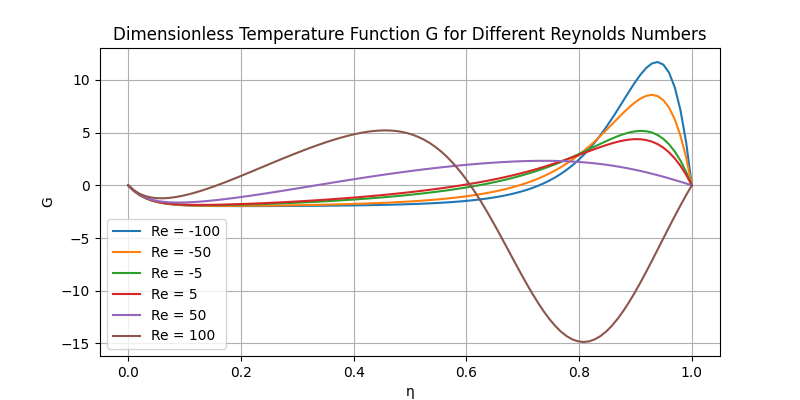

# Jeffery-Hamel Flow Numerical Solution

## Overview
This repository provides comprehensive numerical solutions to the classical Jeffery-Hamel flow problem, a fundamental study in fluid dynamics. The Jeffery-Hamel flow represents the steady, laminar flow of a viscous, incompressible fluid between two rigid planes that intersect at an angle. This work implements the boundary value problem using Python and visualizes key flow characteristics for various Reynolds numbers.



## Theoretical Background

### Historical Context
The Jeffery-Hamel flow was independently studied by Jeffery (1915) and Hamel (1916) as one of the exact similarity solutions to the Navier-Stokes equations. It represents one of the few exact solutions available for non-parallel flows and serves as a benchmark for validating numerical methods in computational fluid dynamics.

### Physical Problem Description
Consider two semi-infinite rigid planes that intersect at an angle 2α. A viscous, incompressible fluid flows through this wedge-shaped domain either toward or away from the vertex. The flow is assumed to be:
- Steady
- Laminar
- Radial (purely in the radial direction)
- Without external forces
- Two-dimensional in polar coordinates (r, θ)

The velocity field has the form:
- Radial velocity: $u_r = \frac{F(\theta)}{r}$
- Angular velocity: $u_\theta = 0$

Where r is the radial distance from the vertex and θ is the angular coordinate measured from the centerline.

## Mathematical Formulation

### Governing Equations
Starting from the Navier-Stokes equations in polar coordinates and applying the similarity transformation, the radial momentum equation reduces to a nonlinear ordinary differential equation:

$$\frac{d^3F}{d\theta^3} + 4\alpha^2\frac{dF}{d\theta} + 2\alpha Re \cdot F \cdot \frac{dF}{d\theta} = 0$$

Where:
- $F(\theta)$ is the dimensionless stream function
- $\alpha$ is half the angle between the planes
- $Re = \frac{\rho v_0}{\mu}$ is the Reynolds number
- $\rho$ is the fluid density
- $\mu$ is the dynamic viscosity
- $v_0$ is a reference velocity

### Boundary Conditions
The boundary conditions for this problem are:
1. At the centerline ($\theta = 0$): $F(0) = 1$ (normalized velocity)
2. At the centerline ($\theta = 0$): $F'(0) = 0$ (symmetry condition)
3. At the walls ($\theta = \pm\alpha$): $F(\pm\alpha) = 0$ (no-slip condition)

### Energy Equation
For the temperature distribution, the energy equation after similarity transformation becomes:

Without viscous dissipation:
$$\frac{d^2G}{d\eta^2} + (4 + 2Pr \cdot F)\frac{dG}{d\eta} = 0$$

With viscous dissipation:
$$\frac{d^2G}{d\eta^2} + (4 + 2Pr \cdot F)\frac{dG}{d\eta} + Pr\left(4F^2 - \left(\frac{dF}{d\eta}\right)^2\right) = 0$$

Where:
- $G(\eta)$ is the dimensionless temperature function
- $\eta = \frac{\theta}{\alpha}$ is the normalized angular coordinate
- $Pr = \frac{\mu C_p}{k}$ is the Prandtl number
- $C_p$ is the specific heat capacity
- $k$ is the thermal conductivity

## Numerical Implementation

### Solution Method
The boundary value problem is solved using the `solve_bvp` function from SciPy, which implements a finite difference method with adaptive mesh refinement. The steps include:

1. Reformulating the third-order ODE as a system of first-order ODEs
2. Defining appropriate boundary conditions
3. Providing an initial guess for the solution
4. Solving the system using adaptive mesh refinement
5. Computing derived quantities (pressure, stresses, etc.) from the solution

### Parameter Settings
In this implementation, the following parameters are used:
- Half-angle: $\alpha = 10°$ (converted to radians)
- Reynolds numbers: $Re \in \{-100, -50, -5, 5, 50, 100\}$
- Fluid density: $\rho = 1.225$ kg/m³ (air at standard conditions)
- Reference velocity: $v_0 = 1.0$ m/s
- Ambient pressure: $p_\infty = 101325$ Pa
- Specific heat: $C_p = 1005$ J/(kg·K)
- Thermal conductivity: $k = 0.0262$ W/(m·K)
- Kinematic viscosity: $\nu = \frac{v_0}{\max(|Re|)}$ m²/s
- Prandtl number: $Pr = \frac{\rho C_p \nu}{k}$

## Derived Quantities

### Pressure Distribution
The pressure coefficient is calculated using:

$$C_p = 1 + \frac{4\alpha^2}{\alpha Re}(1-F) + \frac{1}{\alpha Re}F'''$$

Where $F'''$ is the third derivative of the stream function.

### Shear and Normal Stresses
The shear stress at any point is given by:

$$\tau_{\theta r} = \frac{2}{Re}F'(\eta) \cdot \frac{1}{2}\rho v_0^2$$

The normal stresses are:

$$\tau_{rr} = \frac{4\alpha}{Re}F(\eta) \cdot \frac{1}{2}\rho v_0^2$$

$$\tau_{\theta\theta} = -\tau_{rr}$$

## Flow Characteristics and Results

### Velocity Profiles
The dimensionless velocity profiles show the variation of radial velocity across the channel for different Reynolds numbers:


For positive Reynolds numbers (divergent flow), the velocity profiles tend to be more uniform across the channel. For negative Reynolds numbers (convergent flow), the velocity profiles exhibit steeper gradients near the walls, indicating stronger wall effects.

### Pressure Distribution
The pressure distribution shows how pressure varies across the channel:



For convergent flows (negative Re), pressure increases as the fluid approaches the vertex, while for divergent flows (positive Re), pressure decreases away from the vertex.

### Shear Stress
The shear stress distribution indicates the friction forces at different positions:



Higher magnitude Reynolds numbers result in greater shear stresses at the walls, which is important for estimating frictional losses.

### Temperature Function
The dimensionless temperature distribution with and without viscous dissipation:



Viscous dissipation effects become more pronounced at higher Reynolds numbers, leading to increased fluid temperatures due to internal friction.

## Physical Interpretation

### Reynolds Number Effects
- **Positive Reynolds numbers** (Re > 0): Represent divergent flow (flow from the vertex outward). The flow experiences an adverse pressure gradient, which can lead to flow separation at sufficiently high Reynolds numbers.
  
- **Negative Reynolds numbers** (Re < 0): Represent convergent flow (flow toward the vertex). The flow experiences a favorable pressure gradient, which helps maintain attached flow even at higher magnitudes of Reynolds numbers.

### Flow Stability
The Jeffery-Hamel flow exhibits interesting stability characteristics:
- For divergent flows (Re > 0), the solution becomes unstable beyond a critical Reynolds number.
- For convergent flows (Re < 0), the solution remains stable for a wider range of Reynolds numbers.

### Viscous Dissipation Effects
Viscous dissipation represents the conversion of kinetic energy into thermal energy due to fluid friction. Its effects are more pronounced:
- At higher Reynolds numbers (stronger flows)
- In convergent channels (negative Re) where velocity gradients are steeper
- Near the walls where velocity gradients are maximum

## Applications

The Jeffery-Hamel flow analysis has applications in various fields:
1. **Microfluidics**: Flow in diverging/converging microchannels
2. **Lubrication Theory**: Flow in tapered bearings
3. **Cardiovascular Flows**: Blood flow in arterial bifurcations
4. **HVAC Systems**: Flow in diffusers and nozzles
5. **Geological Flows**: Groundwater flow through converging/diverging fractures

## Code Structure
- `A - Jeffery Hamel.py`: Main implementation that solves the flow equations and computes all flow characteristics
- `B - Jeffery Hamel G with dis.py`: Focused implementation for temperature distribution with viscous dissipation
- `B - Jeffery Hamel G without dis.py`: Focused implementation for temperature distribution without viscous dissipation
- `Jeffery_Hamel.pdf`: Comprehensive documentation and theoretical background

## Requirements
- Python 3.x
- NumPy: For numerical operations
- Matplotlib: For visualization
- SciPy: For boundary value problem solving (`solve_bvp`)

## Usage
To run the code:

```bash
# For complete analysis
python "A - Jeffery Hamel.py"

# For temperature function with dissipation only
python "B - Jeffery Hamel G with dis.py"

# For temperature function without dissipation only
python "B - Jeffery Hamel G without dis.py"
